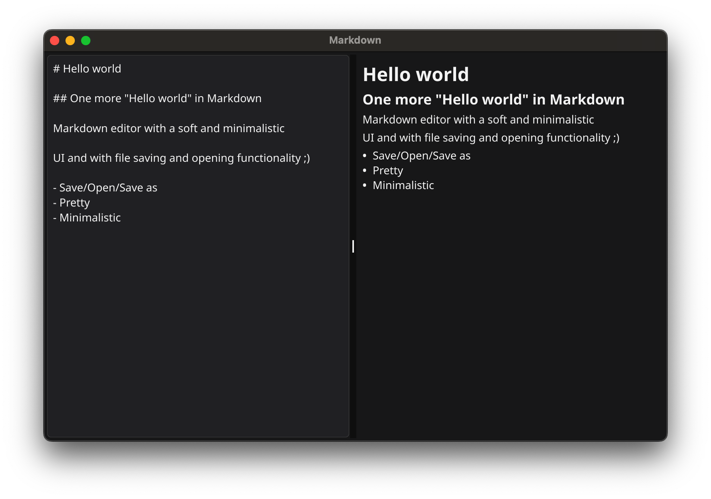

# Desktop Markdown Editor

<div align="center">
   
</div>

<p align="center">
  A minimalistic desktop application written in <b>Go</b> with <b>Fyne</b> library.
</p>

## Installing and running
\* Make sure you have **Go** and **Fyne** installed on your computer.

Run:
```bash
go mod tidy
```

And then run:
```bash
make run # to run the app
# or
make build # to build
```

You can find configs for building in `Makefile`.

---

Guess which Markdown editor I used to create this README? Yeees the best one in the world 🙂!